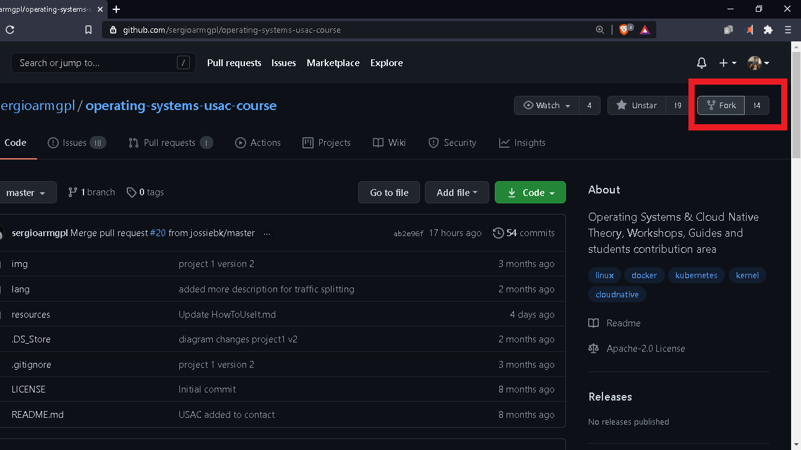
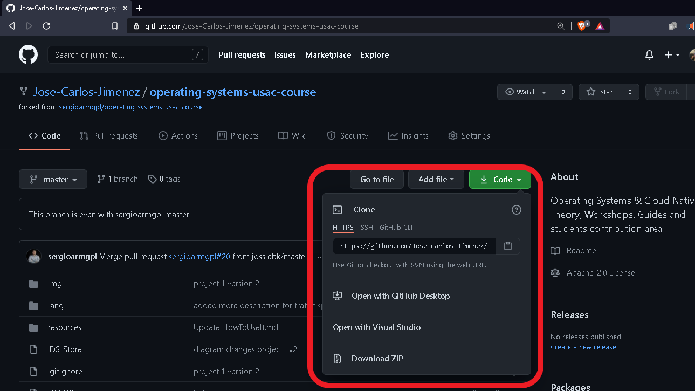
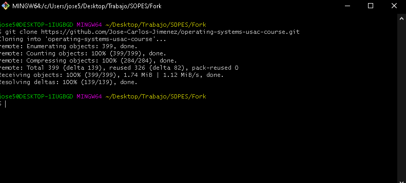
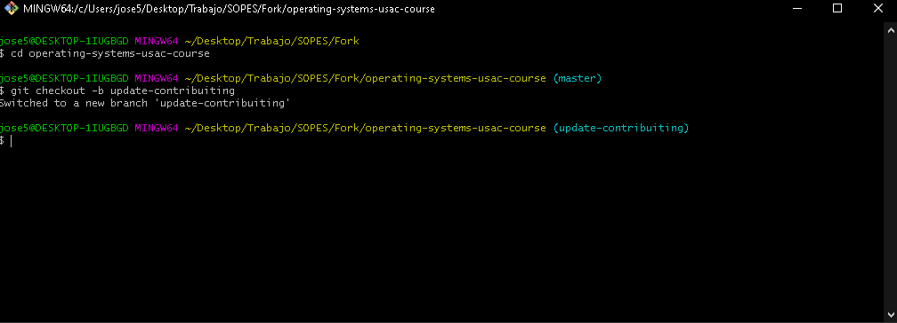
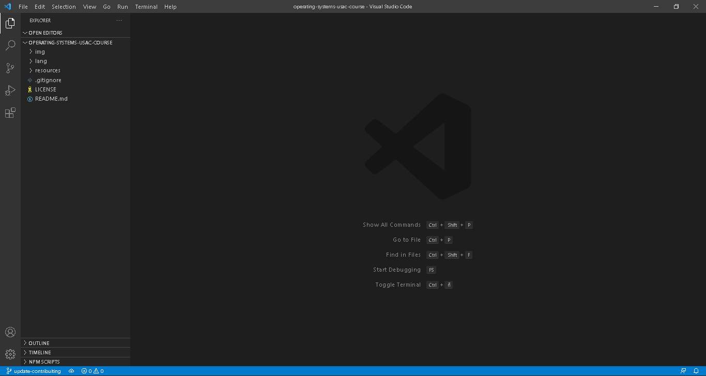
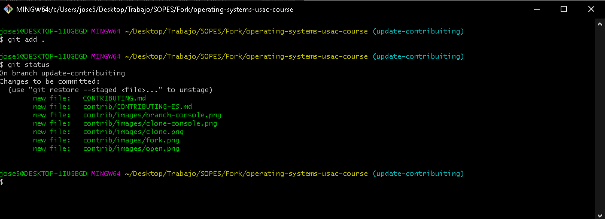
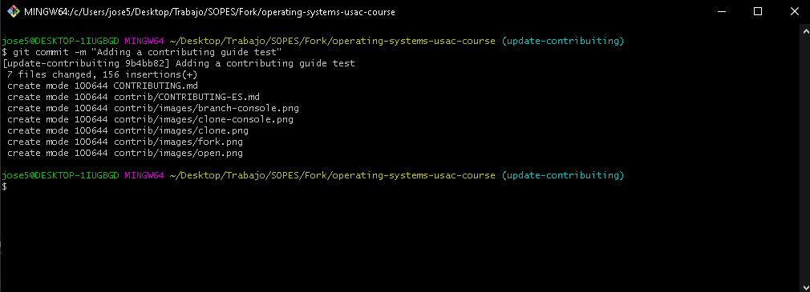
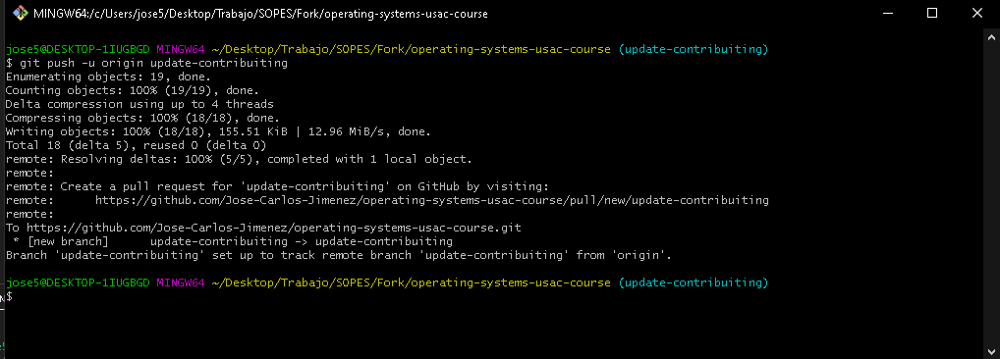
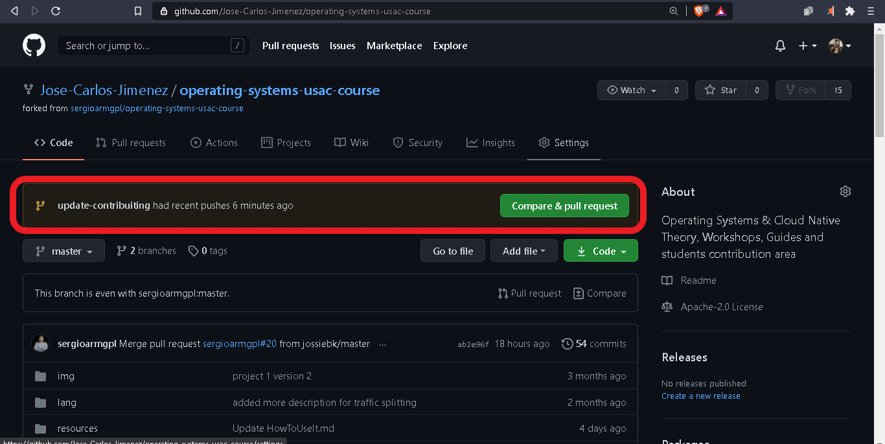
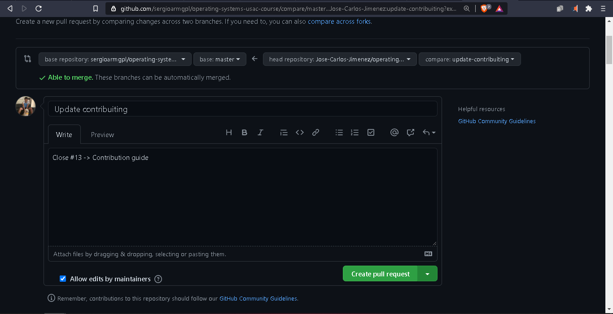

<center>
    <table>
        <tr>
            <td><a href="./CONTRIBUTING.md"> English </a></td>
            <td><a href="./CONTRIBUTING-ES.md"> Español </a></td>
        </tr>
    </table>
</center>

<center> <h1>Contribution guide</h1> </center>
This is a quick little guide to contribute to the repository and general in open source repositories.

The "Issues" can be issued by anyone who wishes.

The steps to make a contribution are as follows:

### 1. Fork the repository.
Inside the repository that you want to contribute you will see a button called fork in the upper right, you must click on it.

In this case it is https://github.com/sergioarmgpl/operating-systems-usac-course.git



### 2. Clone the repository of your github profile, in another words clone your fork.
You must clone the repository you forked, which can be found in your Github profile in the repository area.
  



You can clone it on your computer by executing the following command in the folder you want to store the project, it should be noted that where youruser says you must place your github user.

_```git clone https://github.com/youruser/operating-systems-usac-course.git```_

### 3. Create a specific branch for the specific issue you are working on.  
For this, the following command will be used in your local repository, it should be noted that "branch-name" can be any name.

*```git checkout -b update-contribuiting```*  

It is recommended to give it a name that begins with the prefix ** "update -" ** if it is a new feature.
**For example:**

*```fix-contribuitingLanguage ```*

In case of a bug fix, it is recommended to name the branch with the prefix ** "fix-" ** followed by the name.  
**For example:**

*```fix-contribuitingLanguage ```*



### 4. Open the project in your favorite code editor and make the change to the files you want to contribute to.
This time we will use Visual Studio Code, but it can be anyone.

You can also create new files in the folders you want.




### 5. Add the changes made to your branch.
To see the changes you have made you can use * `` `git status` `` `* in which you will see the files that you have modified or added.

You can add file by file with the command, in which we must indicate the path of the file that we want to contribute.

*``` git add path/to/filename.txt```*

You can also add all the files to which you have made changes using the command

*``` git add .```*



### 6. Commit your changes
At this point you will confirm that the changes you have made are correct and are ready to go to production.

This is done using the command:

*```git commit -m "A description about commited changes"```*



### 7. Upload your changes to the cloud repository.

Here you will upload to your github user the changes you have made using the command

*```git push -u origin branch-name```*



### 8. Create a pull request
You must visit the repository you have forked in your profile, in this section Github will show you a message suggesting to make a pull request, in this case we click on it and it will ask us for a message, in this case it is recommended to do the commit in English language and indicate the Issue that is being addressed.

**For example:**
_```Closes #42```_
  



