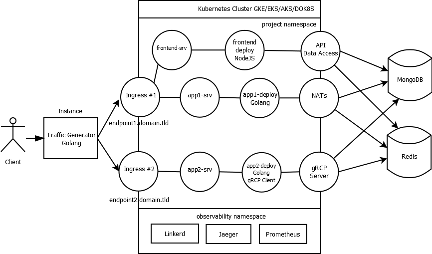

# Project1

**Project Name:** COVID-19 Realtime Visualizer

## Source
**Location:** Guatemala  
**Professor:** Sergio Méndez  
**Authors:** Sergio Méndez & Bryan Ordoñez & David Alvarado

## DESCRIPTION
Build a generic distributed system architecture that shows statistics in realtime using Kubernetes and Cloud Native technologies. This project will be applied to the current infected cases of COVID-19 around the world.
 
## OBJECTIVES
- Understand concurrency and parallelism theory to develop distributed systems.
- Experiment and test with cloud native tecnologies that helps to develop modern distributed systems.
- Design distributed systems strategies to improve high concurrency response.
- Monitor distributed processing using technologies asociated to observability and telemetry.
- Implement containers and orchestrators in distributed systemas.
- Measure relialability and performance in high availability.

## ARCHITECTURE



## FIRST PART (Golang Traffic generator)
This part consist in create a traffic generator written in Golang, this traffic will be received by public load balancers(k8s ingresses) in this case:
- Contour(contour.domain.tld)
- Nginx(nginx.domain.tld)
  
This is the functionaly:
- a file named as traffic-gen will receive 3 parameters:
 - **url:** This is the url to send traffic
 - **file:** File that contains the parameters to send randomly in every request
 - **clients:** Name of simultanious request to send
 - **requests:** Total of request to send

 **File Example:**
 ```
[
    {
        "name":"Pablo Mendoza"
        "location":"Guatemala City"
        "age":35
        "infectedtype":"communitary"
        "state": "asymptomatic"
    }
]
 ```
**Note:** This have to be located at a VM on the cloud

## SECOND PART (Docker, Kubernetes and Load Balancers)
This part contains Git and Docker use, the Kubernetes cluster installation and Load Balancers configuration.

### GIT, DOCKER AND KUBERNETES
**Git:** Git will be the way to store and versioning code on github. Git/Github will be used as a tools to create a collaborative student development enviroment.

**Docker:** Docker will be used to package the applications inside containers, will be preferable to use the distroless technique to create the smallest images size if its posible. Docker will be the tool to create a local enviroment for testing before a Docker image will be deployed to Kubernetes.
  
**Kubernetes:** Before the client machine that generates the traffic the project implements a Kubernetes Cluster which will be used to deploy different objects:
- **Ingress controllers:** To expose different part of applications outside the cluster
- **Deployments and services:** To deploy and communicate different sections of the application
- **Pods:** If necesary. Is common to use a higher abstraction like Deployments instead.
  
Kubernetes will be in charge of the container orchestration of the different parts of the application. Using this kind of technologies the project is designed to create a basic cloud native enviroment and application. A basic 12 factor application.

### LOAD BALANCERS
This part is related to the Layer 7 Load Balancers(Kubernetes Ingress) configuration in the Kubernetes cluster using helm or kubectl. In this project we will two choose two of the following options:
- nginx-ingress
- Contour
- Gloo
- Traefik
  
This part is the way to expose the application to the outside world.
  
### INGRESS 1 AND 2
The goal is to compare the time response for different ingress controllers, mainly the comparation between nginx, envoy and traefik. All the ingress points to a different applications or paths.
  
The project consist in compare the performace and advantages of the two paths implemented in the project.
  
**First path:**  
- Traffic Generator  
- Ingress #1  
- app1-srv  
- app1-deployment-golang  
- NATs  
- Write to MongoDB  
- Write to Redis  

**Second path:**  
- Traffic Generator  
- Ingress #2  
- app2-srv  
- app2-deploy-golang-grpc  
- gRPC-Server  
- Write to MongoDB  
- Write to Redis  
  
**Note:** Will be desired to implement vertical and horizontal autoscaling, coroutines and threads according to the nature of the service to implement. This implemention is open but have to be justified in context of best practices.

## THIRD PART (RPC, BROKERS AND NOSQL DATABASES)
The main idea in this part is to create a high performance way to write data to NoSQL databases, using RPC communication versus Brokers. The goal is to compare the performace of the paths. The implementation consist in the first path will use NATS to receive data to be written to NOSQL Databases, and the other uses a high performance RPC, gRPC. Please refer to the architecture diagram.
  
**NATS**: A way to create queue system, messaging for cloud native application and microservices architectures.
  
**gRPC:** Is a high performance RPC framework that can run in any environment. Used primary to connect backend services.
  
## FOURTH PART (NOSQL DATABASE)
This project was based on a copy of structure of the Instagram Architecture, because of the nature of the system and the no scheme data, will be better to use NoSQL Databases. MongoDB could be used to store persistent data and Redis to implement counters and some caches to display data or analytics in realtime. Is decision of the student how to implement it.
  
**MongoDB:** Is a NoSQL Document database that stores the information using JSON data format.
  
**Redis:** Is a NoSQL Key-Value database that implements different data types like list, sets, sorted sets, etc.
  
This databases will be installed in a instance that have to be accesible in the VPC of the Kubernetes Cluster.

## FIFTH PART (WEBSITE OR MAIN PAGE)
In the last part you have to create a website to show in realtime the inserted data, using a main page(See architecture diagram) developed with NodeJS, React or other progressive Javascript framework. You could use websockets in NodeJS or other language to show date in realtime. This main page have to show the next data:
  
**Data sections:**
- Collections data stored in MongoDB.
- Top 3 of infected areas in MongoDB.
- Pie Chart of infected percentage of states, departments, etc., in MongoDB
- Last 5 infected cases stored in Redis.
- Bar Chart of infectad age range in Redis.

### OBSERVABILITY AND MONITORING
The student have to decide the places to implement observability using Linkerd, Jaeger and Prometheus, using different tecniques .
  
**Jaeger:** The project have to implement tracing with Jaeger in the most important places according to the nature of the system.

**Linkerd:** The project have to implement observability in the network and responses associated to the different pods or deployments implemented in the project. In this the project implements a realtime monitoring for golden metrics.
  
**Prometheus:** The project have to implement monitoring for the state of the services using Prometheus, for example you can use Prometheus to monitor NoSQL Databases and visualize the information using Grafana.

## RESTRICTIONS
- The project have to by developed in trios
- Have to be implemented with the ingresses and languages selected
- Write an tecnical and user manual
- If copies found, the trio will receive a score of 0 points and will be reported.
- Late projects will be not accepted
 
## ARTIFACTS TO DELIVER
- Source Code
- Manuals in PDF format

## Deadline
<Include date of Deadline here>

## REFERENCES
- https://nats.io/
- https://grpc.io/
- https://www.mongodb.com/
- https://redis.io/

## CONTRIBUTE
You can contribute in several ways:
- Edit and improve this content
- Share really awesome ideas
- Provide real data to test in this infrastructure
- Everything is welcome
