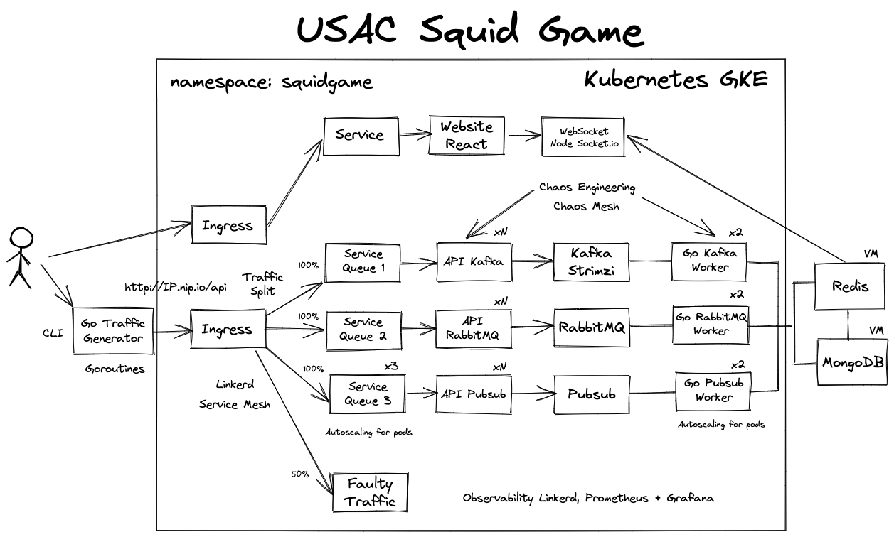

# Project1

**Project Name:** USAC Squid Game

## Source
**Location:** Guatemala  
**Professor:** Sergio Méndez  
**Authors:** Sergio Méndez, Carlos Ramírez

## DESCRIPTION
Build a generic distributed system architecture that shows statistics in realtime using Kubernetes and service mesh such as Linkerd and some other Cloud Native technologies. In the last part we use a service mesh for traffic splitting an faulty traffic generation with Linkerd and Chaos Mesh to implement Chaos Engineering. This project will be applied visualize Covid-19 Vaccinated people around the world.
 
## OBJECTIVES
- Understand concurrency and parallelism theory to develop distributed systems.
- Experiment and test with cloud native tecnologies that helps to develop modern distributed systems.
- Design distributed systems strategies to improve high concurrency response.
- Monitor distributed processing using technologies asociated to observability and telemetry.
- Implement containers and orchestrators in distributed systems.
- Measure relialability and performance in high availability system.
- Implement Chaos Engineering

## ARCHITECTURE


## API Queue


**Explanation:**
The ingress receive the traffic, and is redirected to an API, that writes in a Queue. Before that it receives the number of players and choose randomly an algorithm game, to choose the winner of the current game, then writes the necessary data to the queue. This data will be read by the Go Queue worker first, then will be written to the databases, Redis for realtime data in the dashboards and Mongo for transaction logs.
  
For example a game will have the next rules:
- Generate 10 numbers
- Choose randomly one number as winner the other loose the game.


## FIRST PART (Go Traffic generator)
This part consist in the creation of a tool that generates traffic using Go, Goroutines and channels. This traffic will be received by the ingress controller published in a load balancer, it will be using cip.io site to generate a public URL, for example:

- 193.60.11.13.cio.io, this domain is exposed using an ingress controller and it's load balancer.

### Go generator
This application is written in Go, using Goroutines and channels. The syntaxis for this CLI will be:
```
rungame --gamename "1 | Game1 | 2 | Game2" --players 30 --rungames 30000 --concurrence 10 --timeout 3m
```
  
This is the functionaly:
- **--gamedesc** It has the description of the games, using the format GAME_NUMBER|GAME_NAME
- **--players** Number of players of each game
- **--rungames** Number of Times to run the games
- **--concurrence** Simultaneous request to the API to run the games
- **--timeout** If the remaining time is more than this value the command will stop


## SECOND PART (Docker, Kubernetes and Load Balancers)
This part contains Git and Docker use, the Kubernetes cluster installation and Load Balancers configuration.

### GIT, DOCKER AND KUBERNETES
**Git:** Git will be the way to store and versioning code on github. Git/Github will be used as a tools to create a collaborative student development enviroment.

**Docker:** Docker will be used to package the applications inside containers, will be preferable to use the distroless technique to create the smallest images size if its posible. Docker will be the tool to create a local enviroment for testing before a Docker image will be deployed to Kubernetes.
  
**Kubernetes:** Before the client machine that generates the traffic the project implements a Kubernetes Cluster which will be used to deploy different objects:
- **Ingress controllers:** To expose different part of applications outside the cluster
- **Deployments and services:** To deploy and communicate different sections of the application
- **Pods:** If necesary. Is common to use a higher abstraction like Deployments instead.
  
Kubernetes will be in charge of the container orchestration of the different parts of the application. Using this kind of technologies the project is designed to create a basic cloud native enviroment and application. A basic 12 factor application.

### NAMESPACE
Is a good practice to organice all the application in a separated namespace called project

### LOAD BALANCERS
This part is related to the Layer 7 Load Balancers(Kubernetes Ingress) configuration in the Kubernetes cluster using helm or kubectl. In this project we will choose one of the following options:
- nginx-ingress(Fully tested at the moment)
- Contour
- Gloo
- Traefik
  
This part is the way to expose the application to the outside world.
  
### INGRESS
The goal is to compare the time response and performance for the different paths, one using Go and the other using Redis Pub/Sub. All the input information pass across an ingress controller of your choise nginx, envoy and traefik. 
  
**First path:**  
- Traffic Generator  
- Ingress  
- API Kafka
- Kafka Strimzi  
- Go Kafka Worker
- Write to NoSQL Databases

**Second path:**  
- Traffic Generator  
- Ingress  
- API RabbitMQ
- RabbitMQ  
- Go RabbitMQ Worker
- Write to NoSQL Databases  

**Third path:**  
- Traffic Generator  
- Ingress  
- API Google PubSub
- Google PubSub  
- Go Google PubSub Worker
- Write to NoSQL Databases
  
**Note:** Will be desired to implement vertical and horizontal autoscaling, coroutines and threads according to the nature of the service to implement. This implemention is open but have to be justified in context of best practices.

### TRAFFIC SPLITTING
To implement Traffic Splitting the project will use Linkerd to implement this feature with the idea that the traffic splits 33% traffic to the first path and the other 33% to the second path and so on. To implement this, Linkerd uses a Dummy service that can be the copy of the service of one of the paths, and it has to be used NGINX for this functionaly. Right now its the stable and tested option for this project.

**Desired faulty traffic tests:**
- Queue #1 100%
- Queue #2 100%
- Queue #3 100%
- Queue #1 50%, Faulty Traffic 50%
- Queue #2 50%, Faulty Traffic 50%
- Queue #3 50%, Faulty Traffic 50%
- Queue #1 33.33%, Queue #2 33.33%, Queue #3 33.33%


Take in consideration to answer the following questions:
- How the golden metrics perform, how you can interpret these 4 faulty traffic tests using as base the graphs and metrics that Linkerd Grafana dashboard shows. 
- Mention at least 3 behavior paterns that you discovered.

## THIRD PART (RPC, BROKERS AND NOSQL DATABASES)
The main idea in this part is to create a high performance way to write data to NoSQL databases, using RPC communication versus Brokers. The goal is to compare the performace of the paths. The implementation consist in the first path will use Redis to receive data to be written to NOSQL Databases, and the other uses a high performance RPC, gRPC. Please refer to the architecture diagram.
  
**Redis Pub/Sub**: A way to create queue system, messaging for cloud native application and microservices architectures.
  
**RabbitMQ:** Is an old school queue system mode to work as broker or task processing.

**gRPC:** Is a high performance RPC framework that can run in any environment. Used primary to connect backend services.

**Kafka:** Is a HA queue system mode for streaming data for realtime applications.

Take in consideration to answer the following questions:
- Which queue systems is faster?
- How many resources use each queue system, after looking the Linkerd Dashboard?
- Mention gods and bads of each queue system
- Which one is better?


## FOURTH PART (NOSQL DATABASE)
This project was based on a copy of structure of the Instagram Architecture, because of the nature of the system and the no scheme data, will be better to use NoSQL Databases. MongoDB could be used to store persistent data and Redis to implement counters and some caches to display data or analytics in realtime. Is decision of the student how to implement it.
  
**MongoDB or other:** Is a NoSQL Document database that stores the information using JSON data format. An example of log will be:
{"request_number":30001,"game":1,"gamename":"Game1","winner":"001","players":20}
  
**Redis:** Is a NoSQL Key-Value database that implements different data types like list, sets, sorted sets, etc. Please use sorted lists, hash and values for realtime data on the dashboards.
  
This databases will be installed in a instance that have to be accesible in the VPC of the Kubernetes Cluster.

Take in consideration to answer the next question:
- Which database performs better and why?

## FIFTH PART (WEBSITE OR MAIN PAGE)
In the last part you have to create a website to show in realtime the inserted data, using a main page(See architecture diagram) developed with NodeJS, React or other progressive Javascript framework. You could use websockets in NodeJS or other language to show date in realtime. This main page have to show the next data:
  
**Data sections:**
- Collections data stored in MongoDB.
- Last 10 games.
- Top 10 players.
- Realtime Gamer stats.
- Show transaction logs in MongoDB.

### Frontend examples
**Main Page**  

  
**Player Stats**  


### OBSERVABILITY AND MONITORING
The student have to decide the places to implement observability and golden metrics using Linkerd.

**Linkerd:** The project have to implement observability in the network and responses associated to the different pods or deployments implemented in the project. In this the project implements a realtime monitoring for golden metrics.
  
**Prometheus:** The project have to implement monitoring for the state of the services using Prometheus, for example you can use Prometheus to monitor NoSQL Databases and visualize the information using Grafana.

### CHAOS ENGINEERING
In this part the student has to implement faulty traffic to the system and kill components of the cluster, at the same time shows the behavior of the chaos in the cluster.

**Linkerd:** Use Linkerd for faulty traffic generation

**Chaos Mesh:** Use Chaos Mesh to implement, Slow Network, Pod Kill and Failure, and Kernel fails.

The goal is to monitor the behavior of the system while the Chaos is in progress.

Prepare the next experiments:
- Linkerd, faulty traffic acording to the traffic splitting section
With Chaos mesh prepare the next experiments:
- Pod kill
- Pod failure
- Container kill
- Network Emulation (Netem) Chaos
- DNS Chaos

And answer the next question:
- How each experiment reflect on the Linkerd Graph, What is happen?
- How each experiment are different
- Which experiment is the most harmful experiment

**Note:** The war zone refers to a Chaos Engineering tests running.

## RESTRICTIONS
- The project have to by developed in cuartets 
- Have to be implemented with the ingresses and languages selected
- Write an tecnical and user manual
- If copies found, the trio will receive a score of 0 points and will be reported.
- Late projects will be not accepted
 
## ARTIFACTS TO DELIVER
- Source Code on Github
- Manuals in PDF format

## Deadline
November 10, 2021

## Resources
- [Excalidraw Diagram For the Project](project1.excalidraw)

## REFERENCES
- https://kubernetes.io/
- https://linkerd.io/
- https://grpc.io/
- https://www.mongodb.com/
- https://redis.io/
- https://strimzi.io/
- https://chaos-mesh.org/

## CONTRIBUTE
You can contribute in several ways:
- Edit and improve this content
- Share really awesome ideas
- Provide real data to test in this infrastructure
- Everything is welcome
- Create or work on an issue on this repository
