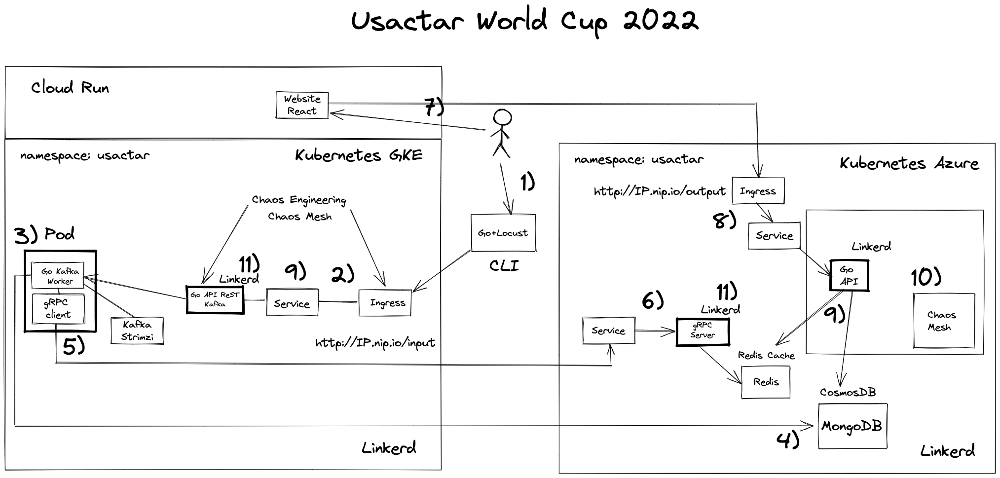
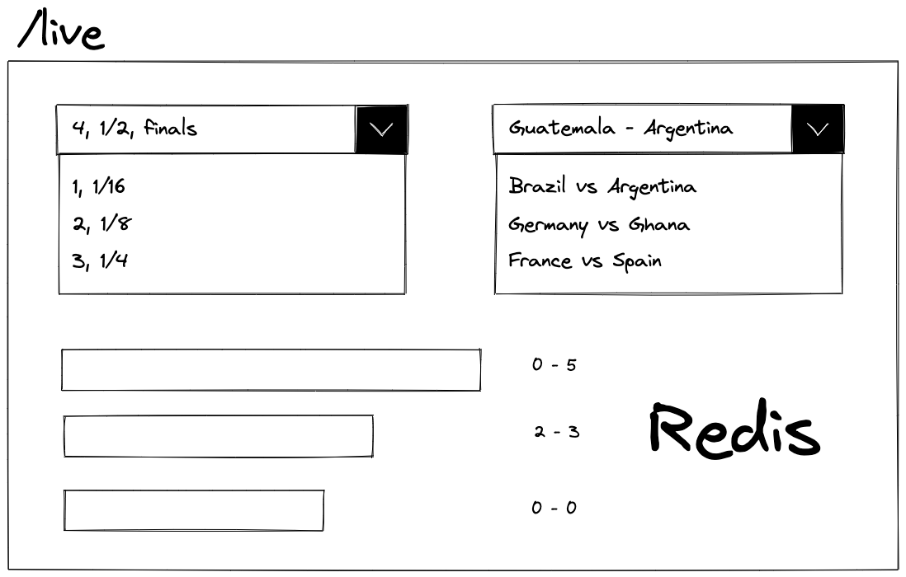
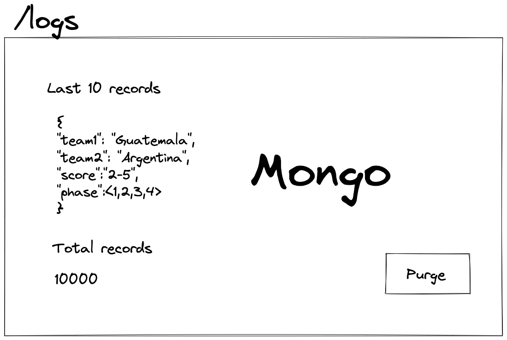

# Project1

**Project Name:** Usactar 2022 soccer match people predictions

## Source
**Location:** Guatemala  
**Professor:** Sergio Méndez  
**Authors:** Sergio Méndez

## DESCRIPTION
Build a generic distributed system architecture that shows the predictions of the people about a soccer match. This data is processed used a multicluster connection. This connection divices data processing into live data and logs. For this project is used Linkerd to interconnect clusters and Chaos Mesh for Chaos Engineering.
 
## OBJECTIVES
- Understand concurrency and parallelism theory to develop distributed systems.
- Experiment and test with cloud native tecnologies that helps to develop modern distributed systems.
- Design distributed systems strategies to improve high concurrency response.
- Monitor distributed processing using technologies asociated to observability and telemetry.
- Implement containers and orchestrators in distributed systems.
- Measure relialability and performance in high availability system.
- Implement Chaos Engineering

## ARCHITECTURE EXPLANATION
In this section is explained how to implement the following architecture:

With this let's explain how is implemented.

### step 1 (Locust +  Go)
This part consist in the creation of a tool that generates traffic using Locust and Go programming language. This traffic will be received by public load balancers(k8s ingresses) in this case:

- http://IP.nip.io/input, this domain is exposed using an ingress controller, in this case NGINX
  
This is the functionaly:
Run the command to send data:
```
run -f data.json --concurrence 10 -n 10000 --timeout 3m  
````
In order to work this reads a JSON file with the next format:
```
{
"team1": "Guatemala",
"team2": "Argentina",
"score":"2-5",
"phase":<1,2,3,4>
}
```
This contains the team that is in the match and the phase of the tournament. 
4 -> Finals
3 -> 1/4 Finals
2 -> 1/8 Finals
1 -> Beginning of the tournament
  
Then the parameters are used as follows:
- --concurrence, is the simultaneous or in parallel requests
- -n, the total of requests sent
- --timeout, if the requests get to slow this parameters will suspend the run
  
This command is build with Go and call Locust to generate the traffic.

## steps 2-4 (Kafka Queue + Mongo)
In this part and API created with Go, receives the requests and the, insert this information in a Kafka topic. In parallel there is a pod which consists in two parts. One that reads the Kafka Topic using Go, to finally write the information into MongoDB. 

## steps 5-6 (gRPC + Redis)
When second, receives the information its transformed to the Protobuf format that will be read it by the gRPC server listening in the other cluster, for this, its necessary a service mirror using the Linkerd multicluster feature, that mirrors the server in the order cluster in order to call the service in the other cluster as if this exists in the same cluster. Finally this server receives the information and install and store the information in Redis, using Hashes and Sets for the /live data page.

## steps 7-9 (Cloud Run)
In this part there is a Frontend application which consists in 2 pages:
- /live, that shows the predictions by the fans

- /logs, that shows the logs of the received data

  
This application programmed in React is deployed using Google Cloud Run, and calls another API programmed in Go in the Azure cluster. This API reads directly the information from Redis Cache and CosmosDB using MongoDB.

## Step 10 (Chaos Mesh)
This consists un running chaos engineering tests using Chaos Mesh, in this case, it has to be destroyed the application that returns the data for the /live realtime page, and optionally for the API that receives the data before insert then into the Kafka topic.

## Step 11 (Linkerd)
This part consists in observe the the API that inserts the data into the Kafka topic, and observe the Go API that reads data for the pages. For this is used Linkerd service mesh, to show some realtime information.

## CONSIDERATIONS

### Cloud and system
You have to create your own container images using Google, Azure and Kubernetes 

### Databases
Use Azure CosmosDB with support for MongoDB for logs and the Redis Cache for Redis, this databases should have access to be used in the Google Cluster

### Multicluster Connection
Use Linkerd to connect the Google and the Azure cluster.

### GIT
Git will be the way to store and versioning code on github. Git/Github will be used as a tools to create a collaborative student development enviroment.

### NAMESPACE
Use namespace to organize your Kubernetes objects

### LOAD BALANCERS
Use the NGINX Ingress Controller to expose your APIs.
  
This part is the way to expose the application to the outside world.
  

### RPC and Brokers
The main idea in this part is to create a high performance way to write data to NoSQL databases, using RPC(gRPC) communication and Brokers(Kafka).
  
**gRPC:** Is a high performance RPC framework that can run in any environment. Used primary to connect backend services.

**Kafka:** Is a HA queue system mode for streaming data for realtime applications.

Take in consideration to answer the following questions:
- How Kafka Works?
- What is the Kafka Behaviour when processing data? Is it slow?

### Website or Main Page
In the last part you have to create a website to show in realtime the inserted data, using the different pages (See architecture diagram) developed with React . You could use websockets in NodeJS. This main page have to show the next data:
  
### Data
- Logs have to be stored in MongoDB.
- Real time data have to be stored in Redis.
- Replicate real data based on Quatar 2022.

### Observability and Monitoring
The student have to implement observability and golden metrics using Linkerd based on the diagram.

**Linkerd:** The project have to implement observability in the network and responses associated to the different pods or deployments implemented in the project. In this the project implements a realtime monitoring for golden metrics.
  
**Prometheus:** The project have to implement monitoring for the state of the services using Prometheus, for example you can use Prometheus to monitor NoSQL Databases and visualize the information using Grafana.

### Chaos Engineering
In this part the student has kill components of the cluster, at the same time shows the behavior of the chaos in the cluster.

**Chaos Mesh:** Use Chaos Mesh to implement, Slow Network, Pod Kill and Failure, and Kernel fails.

The goal is to monitor the behavior of the system while the Chaos is in progress.

Prepare the next experiments:
- Pod kill
- Pod failure
- Container kill

And answer the next question:
- How each experiment reflect on the Linkerd Graph, What is happen?
- How each experiment are different
- Which experiment is the most harmful experiment

**Note:** The war zone refers to a Chaos Engineering tests running.

## PENALTIES
- The project have to by developed in trios 
- Have to be implemented with the ingresses and languages selected
- Write an tecnical and user manual
- If copies found, the trio will receive a score of 0 points and will be reported.
- Late projects will be not accepted
 
## ARTIFACTS TO DELIVER
- Source Code on Github
- Manuals in PDF format

## Deadline
Nov 4th, 2022

## REFERENCES
- https://kubernetes.io/
- https://linkerd.io/
- https://grpc.io/
- https://www.mongodb.com/
- https://redis.io/
- https://strimzi.io/quickstarts/
- https://chaos-mesh.org/
- https://docs.locust.io/en/stable/
- Covid Realtime Project: https://www.youtube.com/watch?v=IOMQ2ijkKQs
- gRPC Intro: https://www.youtube.com/watch?v=ftefBd0t61w


## CONTRIBUTE
You can contribute in several ways:
- Edit and improve this content
- Share really awesome ideas
- Provide real data to test in this infrastructure
- Everything is welcome
- Create or work on an issue on this repository
