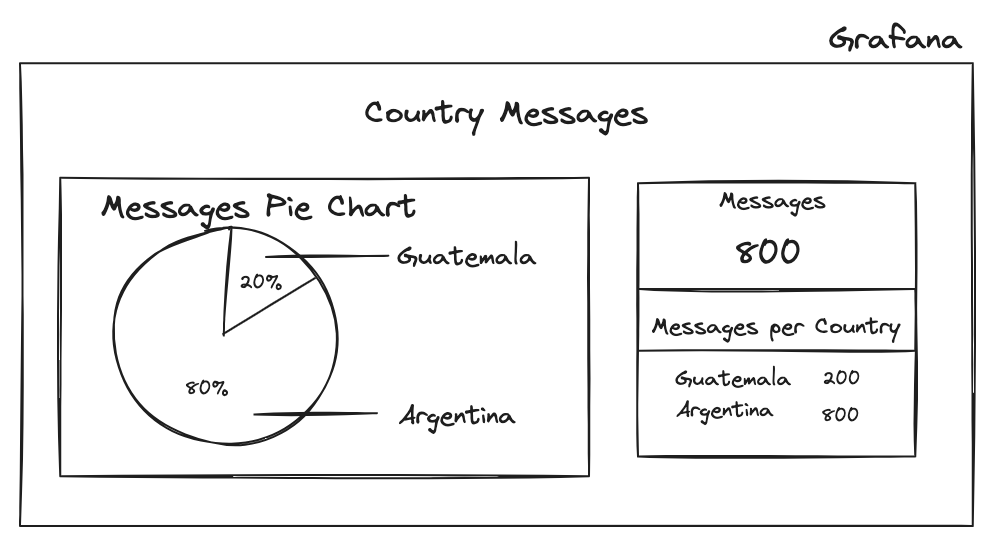

# Project1

**Project Name:** 2023 Weather Tweets

## Source
**Location:** Guatemala  
**Professor:** Sergio Méndez  
**Authors:** Sergio Méndez

## DESCRIPTION
Build a generic distributed system architecture that shows the tweets about weather around the world. This is processed by a conceptual architecture that can be scalable. This project pretends to show tweets concurrency in the system. Also, measure the amount of power a CO2 used by the deployments of the project.
 
## OBJECTIVES
- Understand concurrency and parallelism theory to develop distributed systems.
- Experiment and test with cloud native tecnologies that helps to develop modern distributed systems.
- Design distributed systems strategies to improve high concurrency response.
- Monitor the power and CO2 used by the deployments in Kubernetes to monitor environmental sustainability projects whe students can experiment.
- Implement containers and orchestrators in distributed systems.
- Use contemporary RPC microservices communication.
- Create a HPC system to process messages.

## ARCHITECTURE EXPLANATION
In this section is explained how to implement the following architecture:

With this let's explain how is implemented.

### step 1 (Locust +  Go)
This part consist in the use of Locust to send concurrent traffic. This traffic will be received by public load balancers(k8s ingresses) in this case:

- http://IP.nip.io/input, this domain is exposed using an ingress controller, in this case NGINX

Locust should use a concurrence parameters to simulate at least 10 concurrent clients and 10000 request in total.

Locust shoul read a JSON file with random data, in the next format:
```
{
"text": "Its raining",
"country": "Argentina",
},
{
"text": "Its raining again",
"country": "Argentina",
},
{
"text": "The weather is so nice",
"country": "Guatemala",
}
```

## API (Deployment)
In this deployment and API created with Go, receives the requests and insert this information in a Kafka topic by using gRPC. In parallel there is a pod which consists in three containers:
1. api container: Reads the REST information and calls the gRPC server using a gRPC client and send the text and country information to be stored in Mongo. Additionally, should call a Rust container to insert data into Redis.
2. gRPC server container: Insert data into a Kafka topic called **messages** when its called by its service. This uses Go language.
3. Rust container: This is implements a WebSockets that listen to data to insert into Redis. This uses Rust language.

## Grafana (Deployment)
This deployment works to visualize the messages in the system as follows:

This deployment uses Redis to visualize this data, so the data inserted in Redis should contain all the necessary information.
A quick tip is to use Hash tables in Redis to store a Country counter and a total counter of messages.

## Kafka Client (Deployment)
You need to create a Kafka client code, using Go, using the Confluent Kafka libraries to create a client that consumes messages from a Topic called Message. This uses Go language.

## Kepler (Helm installed)
You need to install Kepler to visualize Power compsumption and Carbon emisions per Pod. This should be installed using Helm.

## Strimzi (Kafka)
You need to setup Kafka cluster by using Strimzi a Kubernetes operator that simplify the installation. This should be installed using Helm.

## CONSIDERATIONS

### Cloud and system
You have to create your own container images using Docker and a Kubernetes cluster in Google Cloud.

### Databases
This project uses Redis and Mongo DB so should be installed using deployments with their own service to enable the access of this databases inside the Kubernetes internal network. In this way the deployments can insert data into this databases.

### GIT
Git will be the way to store and versioning code on github. Git/Github will be used as a tools to create a collaborative student development enviroment.

### NAMESPACE
Use namespace to organize your Kubernetes objects, in this case use **project**.

### LOAD BALANCERS
Use the NGINX Ingress Controller to expose your APIs.
  
This part is the way to expose the application to the outside world.
  
### RPC and Brokers
The main idea in this part is to create a high performance way to write data to NoSQL databases, using RPC(gRPC) communication and Brokers(Kafka).
  
**gRPC:** Is a high performance RPC framework that can run in any environment. Used primary to connect backend services.

**Kafka:** Is a HA queue system mode for streaming data for realtime applications.

Take in consideration to answer the following questions:
- How Kafka Works?
- What is the Kafka Behaviour when processing data? Is it slow?

### Data
- Logs have to be stored in MongoDB.
- Real time data have to be stored in Redis.
- Replicate real data based on Twitter(X) in the last days.

## PENALTIES
- The project have to by developed in duos
- Have to be implemented with the ingresses and languages selected
- Write an tecnical and user manual
- If copies found, the duo will receive a score of 0 points and will be reported.
- Late projects will be not accepted
 
## ARTIFACTS TO DELIVER
- Source Code on Github
- Manuals in PDF format

## Deadline
Jun 28th, 2024

## REFERENCES
- https://kubernetes.io/
- https://grpc.io/
- https://www.mongodb.com/
- https://redis.io/
- https://strimzi.io/quickstarts/
- https://docs.locust.io/en/stable/
- Covid Realtime Project: https://www.youtube.com/watch?v=IOMQ2ijkKQs
- gRPC Intro: https://www.youtube.com/watch?v=ftefBd0t61w
- Confluent Kafka Libraries: https://github.com/confluentinc/confluent-kafka-go
- Kepler: https://sustainable-computing.io/
- Code that you can use: [view](yaml)


## CONTRIBUTE
You can contribute in several ways:
- Edit and improve this content
- Share really awesome ideas
- Provide real data to test in this infrastructure
- Everything is welcome
- Create or work on an issue on this repository
