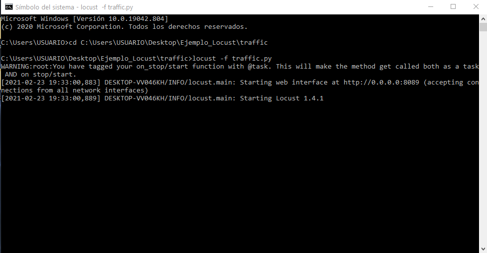
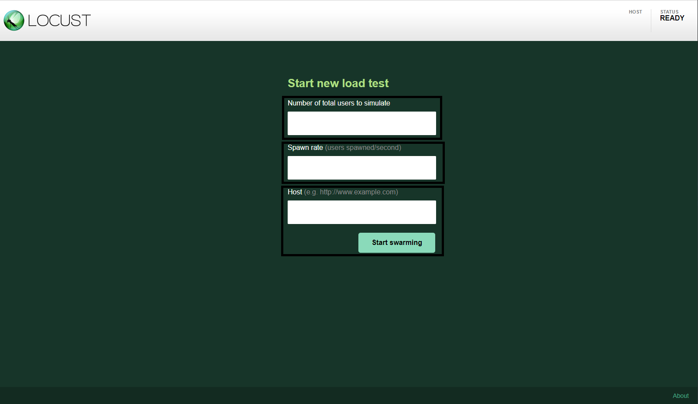
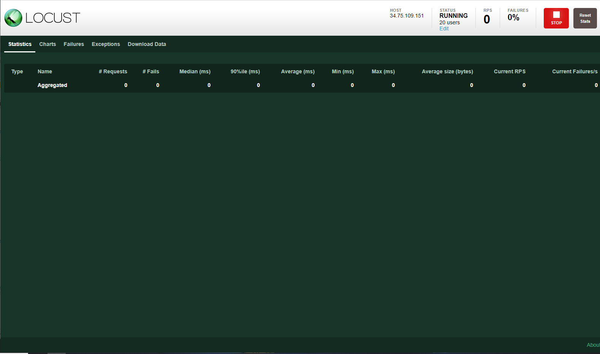

# Locust guide

Locust is an open source testing tool, after installation we can use it as normal Python module and import the code from other files or packages.

### Installation
1. Run the following command in your terminal/CMD.
- > pip install locust

2. Validate the installation by running.
- > locust --v

3. To check what other options you can use.
- > locust --help

### Using Locust for a test
1. Start Locust
- In the path of your "traffic.py" file run:
  > locust -f path/traffic.py
  
-This will start running the test application on your console and gives you an IP address to acces the graphical interface.
  
  
  
  
2. Copy that IP address and paste it in your browser, you will se a green page asking for some information.
- If you have trouble accessing the page try "localhost:port".

3. Add the following data as you need.
- Number of total users to simulate: this will be the quantity of records in your Json file.
- Spawn rate:  the amount of users per second that you want to simulate.
- Host: the IP/Domain of the server you are testing.

4. You will access a page that shows you some statitstics about the testing where you can see in a general way, some charts to make it more dynamic, failures, exceptions  and a tab where you can down load the data. In the right corner you can stop or reset the stats.

5. In you console type ctrl + c to stop the Locust python application and you will see general statistics about the test, and information of the errors.

